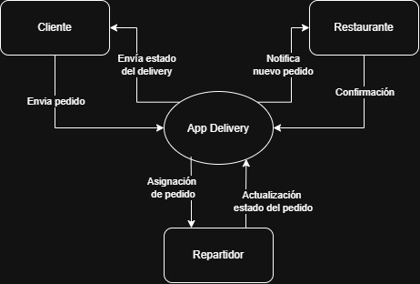

# Respuestas — Ejercitario Unidad 02

---

## Tema 1 · Propiedades de los sistemas

**1. Define en tus propias palabras qué es un sistema y da un ejemplo distinto al utilizado en clase.**

_Respuesta:_

**2. Enumera los seis elementos de un sistema basado en computadora.**

_Respuesta:_

**3. Piensa en un sistema cotidiano (por ejemplo, una biblioteca, un supermercado o un club deportivo) y completa la tabla con un ejemplo propio para cada propiedad.**
Ejemplo elegido: Supermercado.
| Propiedad | Ejemplo en el sistema elegido |
|---|---|
| Jerarquía | Estructura organizacional compuesta por la gerencia general en el nivel superior, jefes de sección (cajas, logística, frescos) en el nivel medio, y cajeros o reponedores en el nivel operativo. |
| Límites (fronteras) | Las paredes físicas del establecimiento, el horario comercial de atención al público y las puertas de acceso/salida delimitadas por las cajas registradoras y los sistemas de seguridad. |
| Interrelación de elementos | El sistema de inventario vincula las ventas registradas en las cajas con el almacén, activando automáticamente alertas para que el personal de reposición llene las góndolas vacías. |
| Propiedades emergentes | La experiencia de compra general o la rentabilidad total, atributos del sistema completo que no existen en ninguna de sus partes aisladas (un carrito, una caja o un pasillo) sino de su interacción conjunta. |

**4. Dentro del mismo sistema, identifica un posible subsistema y justifica por qué lo consideras tal.**

_Respuesta:_
Subsistema de cajas y cobro ya que está formado por las terminales de punto de venta (POS), los escáneres de códigos de barras, las cintas transportadoras, el dinero en efectivo, las lectoras de tarjetas y los cajeros humanos o de autopago, teniendo como propósito específico el formalizar la transacción comercial, registrar la salida de mercancía y procesar el pago del cliente, posee un flujo de trabajo interno cerrado y reglas operativas propias (apertura de caja, arqueo, validación de medios de pago) y a pesar de operar de manera autónoma en su sección, sus salidas impactan directamente en otros subsistemas del supermercado: actualiza en tiempo real el inventario de la tienda y alimenta el flujo financiero de la gerencia general.

---

## Tema 2 · Los sistemas y su entorno

**5. Elige un sistema de software que uses habitualmente e identifica: una entrada, una salida y un elemento de su entorno.**
| Elemento | Descripción en el sistema elegido |
|---|---|
| Sistema elegido | Spotify |
| Una entrada | La acción del usuario al buscar y hacer clic en el botón de reproducir sobre una canción o lista de reproducción específica. |
| Una salida | La transmisión del flujo de datos de audio (streaming) a través de los altavoces o auriculares, acompañada de la interfaz gráfica actualizada que muestra la carátula y el progreso de la pista. |
| Un elemento del entorno | La conexión a Internet (proveedor de red o red Wi-Fi local), que es externa al sistema pero indispensable para que este pueda recibir las peticiones y descargar los paquetes de audio. |

**6. ¿El sistema que elegiste es abierto o cerrado? Justifica tu respuesta.**

_Respuesta:_
Spotify es un sistema abierto ya que mantiene una comunicación bidireccional permanente con su entorno. Recibe entradas constantes del exterior (comandos de los usuarios, actualizaciones de red, transacciones de pago) y emite salidas hacia este (flujos de audio, reportes de uso a artistas y discográficas), requiere de elementos que están fuera de su control directo para operar, como la infraestructura de Internet de los usuarios, las redes de distribución de contenidos (CDN) y los servidores en la nube de terceros y a diferencia de un sistema cerrado (que opera en un entorno hermético sin influencias externas), Spotify se adapta y modifica en función de las condiciones del entorno, como la velocidad de conexión del usuario o las políticas de las tiendas de aplicaciones móviles.

**7. Explica con tus palabras qué es la retroalimentación (feedback) en un sistema y da un ejemplo.**

_Respuesta:_La retroalimentación es la información de salida que vuelve a entrar al sistema para corregirlo. 
Ejemplo: El termostato mide la temperatura y apaga/enciende el aire.

**8. Para el mismo sistema, menciona una restricción externa real que podría afectarlo, indicando si es organizacional, regulatoria o tecnológica.**

_Respuesta:_
Restricción externa**
R: Restricción Tecnológica. Ejemplo: Una app debe funcionar con Android 8 porque el cliente no puede comprar celulares nuevos.

---

## Tema 3 · Modelado de sistemas

**9. Menciona dos razones por las cuales es útil modelar un sistema antes de construirlo.**

_Respuesta:_
1. Reducir la complejidad: Ver el sistema en partes antes de codificar.
2. Validar requisitos: Mostrarle al cliente cómo va a funcionar antes de gastar plata.

**10. Ejercicio de relación** (completá con el número que corresponda a cada letra):

| Nivel de visión | Descripción |
|---|---|
| A. Visión del mundo (worldview) | 3 |
| B. Visión del dominio | 4 |
| C. Visión del elemento | 1 |
| D. Visión detallada | 2 |

1. El sistema particular que se va a construir, dentro del dominio.
2. Los componentes internos del sistema: software, hardware, datos, etc.
3. El contexto global: todos los sistemas y organizaciones que interactúan.
4. El sector o área específica del negocio dentro de ese contexto.

**11. Explica la diferencia entre vista estructural y vista de comportamiento, y da un ejemplo de notación para cada una.**

La diferecnia principal es que la vista estructural se centra en los aspectos estaticos, ya que corresponde a la forma en la que están organizados los elementos del sistema y cómo interactual (Por ejemplo, los Diagramas de Clases). Mientras que la vista de comportamiento se centra en los aspectos dinámicos, ya  muestra cómo el sistema responde a diferentes eventos y cómo cambia su estado a lo largo del tiempo (por ejemplo, el Diagrama de actividad)

**12. Diagrama de contexto:** elige un sistema simple (por ejemplo, un cajero automático, una app de delivery) y dibujá un diagrama de contexto que muestre el sistema y al menos dos entidades externas con las que interactúa. Adjuntá la imagen acá abajo.

**13. ¿En qué situación elegirías usar simulación en lugar de un modelo estático? Da un ejemplo concreto.**

Elejiria usar la simulacion cuando el sistema cambia con el tiempo y tiene elementos que ocurren al azar o de forma imprevisible (como filas o tráfico), donde un cálculo fijo no sirve o no es suficiente.

Ejemplo: El sistema de cajas de un supermercado. Un modelo estático solo calcularía un promedio de cuánta gente compra al día. En cambio, una simulación mostraría cómo se forman las filas largas en horas pico cuando llegan muchos clientes juntos y al azar, ayudando a saber cuántas cajas abrir.

---

## Tema 4 · El proceso de Ingeniería de Sistemas

**14. Explica la diferencia entre Ingeniería de procesos de negocio e Ingeniería de producto, dando un ejemplo de cada una.**

_Respuesta:_

**15. Ordena numéricamente (1 a 4) los siguientes pasos genéricos del proceso de Ingeniería de Sistemas, según la secuencia vista en clase.**

| N.º | Paso |
|---|---|
| | Especificación del sistema |
| | Definición de necesidades |
| | Asignación de requisitos entre elementos |
| | Análisis de factibilidad |

**16. Reflexión final:** ¿por qué crees que es importante que un ingeniero de software comprenda el sistema completo (Ingeniería de Sistemas) antes de comenzar a programar? Relaciona tu respuesta con algún ejemplo visto en la Unidad 01 o en esta unidad.

_Respuesta:_

